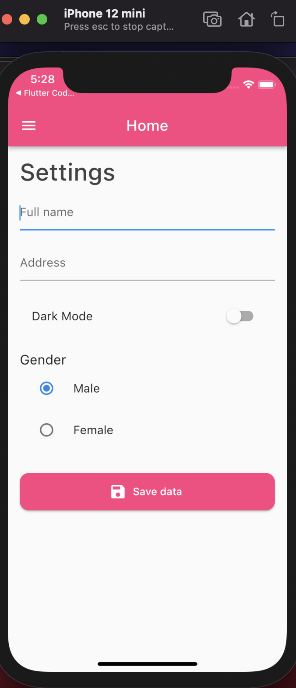

# flutter Shared Preference:

A new Flutter project.

## ScreenShot:
![test image size]

## Getting Started

into pubspec.yaml:

The following adds the Cupertino Icons font to your application, And Also Shared preferences:
  cupertino_icons: ^1.0.2
  shared_preferences: ^2.0.15
　

```dart

//Shared Preference to save data:
  _saveData() async {
    //You must call instance of SharedPreferences:
    SharedPreferences prefs = await SharedPreferences.getInstance();

    prefs.setString("fullName", _fullNameController.text);
    prefs.setString("address", _addressController.text);
    prefs.setBool("darkMode", darkMode);
    prefs.setInt("gender", gender);
    print("Saving...");
  } 

  
  //Create method in order to get data:
  _getDataFull() async {
    SharedPreferences prefs = await SharedPreferences.getInstance();
    print(prefs.getString("fullName"));
    print(prefs.getString("address"));
    print(prefs.getBool("darkMode"));
    print(prefs.getInt("gender"));

    _fullNameController.text = prefs.getString("fullName") ?? "";
    _addressController.text = prefs.getString("address") ?? "";
    darkMode = prefs.getBool("darkMode") ?? false;
    gender = prefs.getInt("gender") ?? 1;

    setState(() {});
  } 
```


A few resources to get you started if this is your first Flutter project:

- [Lab: Write your first Flutter app](https://flutter.dev/docs/get-started/codelab)
- [Cookbook: Useful Flutter samples](https://flutter.dev/docs/cookbook)

For help getting started with Flutter, view our
[online documentation](https://flutter.dev/docs), which offers tutorials,
samples, guidance on mobile development, and a full API reference.
