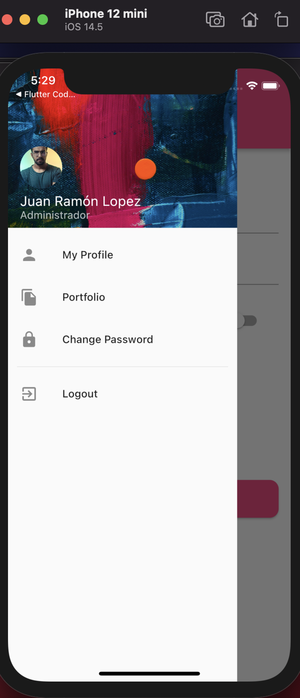

# flutter Shared Preference:

A new Flutter project.

## ScreenShot:

Home Page: 


#### Radio Button:
```dart


Column(
              crossAxisAlignment: CrossAxisAlignment.start,
              children: [
                const Text(
                  "Gender",
                  style: TextStyle(
                    fontSize: 18.0,
                  ),
                ),
                RadioListTile(
                  title: Text("Male"),
                  value: 1,
                  groupValue: gender, //gender is a int variable number
                  onChanged: (int? value) {
                    gender = value!;
                    setState(() {});
                  },
                ),
                RadioListTile(
                  title: Text("Female"),
                  value: 2,
                  groupValue: gender,
                  onChanged: (int? value) {
                    gender = value!; //gender is a int variable number
                    setState(() {});
                  },
                ),
              ],
            ),
            

```

Home Page - Drawer: 



```dart
drawer: Drawer(
        elevation: 0,
        child: Column(
          children: [
            DrawerHeader(
              decoration: const BoxDecoration(
                color: Colors.pinkAccent,
                image: DecorationImage(
                  fit: BoxFit.cover,
                  image: NetworkImage(
                      "https://images.pexels.com/photos/1145720/pexels-photo-1145720.jpeg?auto=compress&cs=tinysrgb&dpr=2&h=650&w=940"),
                ),
              ),
              child: SizedBox(
                width: double.infinity,
                child: Column(
                  crossAxisAlignment: CrossAxisAlignment.start,
                  mainAxisAlignment: MainAxisAlignment.end,
                  children: const [
                    CircleAvatar(
                      radius: 28,
                      backgroundImage: NetworkImage(
                          "https://images.pexels.com/photos/1516680/pexels-photo-1516680.jpeg?auto=compress&cs=tinysrgb&dpr=2&h=650&w=940"),
                    ),
                    SizedBox(
                      height: 6.0,
                    ),
                    Text(
                      "Juan Ramón Lopez",
                      style: TextStyle(
                          color: Colors.white,
                          fontWeight: FontWeight.w400,
                          fontSize: 18.0),
                    ),
                    Text(
                      "Administrador",
                      style: TextStyle(
                        color: Colors.white70,
                        fontWeight: FontWeight.w400,
                        fontSize: 14.0,
                      ),
                    ),
                  ],
                ),
              ),
            ),
            ListTile(
              leading: Icon(
                Icons.person,
              ),
              title: Text("My Profile"),
              onTap: () {
                Navigator.push(context,
                    MaterialPageRoute(builder: (context) => ProfilePage()));
              },
            ),
            ListTile(
              leading: Icon(
                Icons.file_copy,
              ),
              title: Text("Portfolio"),
            ),
            ListTile(
              leading: Icon(
                Icons.lock,
              ),
              title: Text("Change Password"),
            ),
            Divider(
              thickness: 0.6,
              indent: 12,
              endIndent: 12,
            ),
            ListTile(
              leading: Icon(
                Icons.exit_to_app,
              ),
              title: Text("Logout"),
            ),
          ],
        ),
      ),
      

```
## Getting Started

into pubspec.yaml:

The following adds the Cupertino Icons font to your application, And Also Shared preferences:
 
　
```dart
  cupertino_icons: ^1.0.2
  shared_preferences: ^2.0.15

```
### main.dart:

```dart
void main() async {
  //Es importante agregar estas 2 lineas para usar el share preference de manera global:
  WidgetsFlutterBinding();
  SPGlobal sharedPreferences = SPGlobal();
  await sharedPreferences.initShared();

  return runApp(MyApp());
}

```
#### Methot

```dart

//Shared Preference to save data:
  _saveData() async {
    //You must call instance of SharedPreferences:
    SharedPreferences prefs = await SharedPreferences.getInstance();

    prefs.setString("fullName", _fullNameController.text);
    prefs.setString("address", _addressController.text);
    prefs.setBool("darkMode", darkMode);
    prefs.setInt("gender", gender);
    print("Saving...");
  } 

  
  //Create method in order to get data:
  _getDataFull() async {
    SharedPreferences prefs = await SharedPreferences.getInstance();
    print(prefs.getString("fullName"));
    print(prefs.getString("address"));
    print(prefs.getBool("darkMode"));
    print(prefs.getInt("gender"));

    _fullNameController.text = prefs.getString("fullName") ?? "";
    _addressController.text = prefs.getString("address") ?? "";
    darkMode = prefs.getBool("darkMode") ?? false;
    gender = prefs.getInt("gender") ?? 1;

    setState(() {});
  } 
```


A few resources to get you started if this is your first Flutter project:

- [Lab: Write your first Flutter app](https://flutter.dev/docs/get-started/codelab)
- [Cookbook: Useful Flutter samples](https://flutter.dev/docs/cookbook)

For help getting started with Flutter, view our
[online documentation](https://flutter.dev/docs), which offers tutorials,
samples, guidance on mobile development, and a full API reference.
